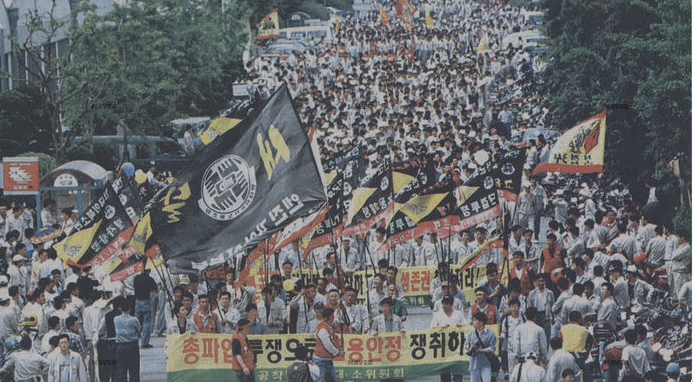

# The Asian Financial Crisis of 1997

If the Latin American debt crisis was an experiment on the
continental scale to establish the IMF's racial logic, the
Asian debt crisis was that logic's maturation and extension
across the entire globe. The Asian financial crisis allowed the
IMF to expand its unequal system into a true hierarchy, one
where placements of some of the lesser nations could be used to
castigate others. It was born out of conditions very similar to
those that created the Latin American debt crisis, beginning
out of a surge of investment from foreign creditors in the
1980s. A series of shocks in the global financial world
(including the Latin American debt crisis) led to this
"investment" becoming unrepayable debts that mounted higher and
higher. Thailand eventually became the first to acknowledge
these debts could not be repaid in July 1997. A chain reaction
of foreign divestment began, leading to the closure of giant
corporations in Asia, millions of people losing their jobs, and
intervention from the IMF becoming the only possible option for
affected countries.^[Farallon Capital Management was a major
robber of public resources in Indonesia after the Asian
Financial Crisis, purchasing a majority stake in Bank Central
Asia in 2002 and earning back its money every year it held the
bank from interest payments from the Indonesia government. Yale
University was strongly implicated in this maneuver;
then-graduate student activists believed Yale to hold $400
million to $5 billion in the hedge fund, alongside endowment
funds for many other institutions including the University of
Pennsylvania, the University of Michigan, and Duke University.
A reminder that the modern university, far from being simply an
arena for intellectual reproduction, actively and violently
participates in dispossession of public resources around the
globe. See @ciafoneFaRallonEndowment2005 for an extensive
research on this topic.] These interventions were coupled with
higher interest rates and more stringent conditions than those
that had been suggested for Latin American countries, even
while the 1980s had revealed harsh reforms to be a failure.

As will be argued in this section, most profitable for the IMF
was that the crisis seemed to stem from Asian financial
misbehavior and the IMF's interventions appeared to succeed.
South Korea, for example, paid its loan amount of $21 billion
back four years before the required deadline of 2005, leading
to congratulatory remarks from IMF Managing Director Horst
Kohler. Kohler would state that the relationship between the
IMF and South Korea "has been exemplary and in many respects
serves as a model for other countries."^[@kohler2001] For other
nations, Kohler and other IMF officials would issue similar but
tamer remarks that the crisis had been born out of
non-cooperation but was solved through "acceptable" repayment
schedules and policy adoptions. By leveraging the blame onto
the crisis-ridden nations, the IMF avoids culpability of itself
and of creditor banks that participated in the speculation at
the center of the crisis. More broadly, the discourse of the
IMF allows itself to be painted as a fundamentally necessary
policy institution in order for debtor countries to be properly
incorporated into the Western world of capitalism and to be
saved should they fail.

The rest of this section explores this series of events in
greater detail. I first discuss the years building up to the
crisis, specifically the economic and political liberalization
of the 1980s that several Asian economies underwent, as well as
the foreign speculative investment that emerged in response to
this liberalization. This is followed by a discussion of the
crisis itself, from outbreak and escalation to intervention and
aftermath. I conclude by discussing the post-crisis analyses
that the IMF and its critics have undertaken to retrospectively
understand the crisis.

The history here will focus on South Korea, and for context
will include the crisis' development in Thailand. But, as I
will explain below, the logic the IMF deploys in these
countries applies generally to what some term the "Late
Industrializers," or the nations in Asia that experienced
various spurts in growth throughout the second half of the 20th
century. These nations were devastated by war or held back by
imperial powers (or in the case of Japan, was left in shambles
after its empire's collapse) throughout the 1900s, but their
unexpected and rapid development made them attractive
investment opportunities for Western investors in the late
1980s. They strode to enter the realm of capitalist modernity,
but they did so through state-led strategies that drew
criticism from free-market enthusiasts of the West. Eventually,
this Western distate and debt to Western countries together
boiler over, forcing a reorganization and disciplinary process
of Asian economies into terms more amenable to the IMF. All of
this and its aftermath allowed the logic of the IMF to value
Asian models of development as more legitimate than models of
development in Latin America and Africa, and as proximate but
not completely accepted by the West. In this way, the crisis
both built off of and elaborated on racial hierarchies of
empires past.

## Speculation

For Thailand and South Korea, the decade and a half leading up
to the crisis can be described both as an economic boom and a
series of mistakes that would lead to meltdown in 1997. In
other parts of the world, these periods can be considered
fairly tumultuous economically. Financial institutions
worldwide panicked after Saddam Hussain's invasion of Kuwait in
1990, leading to a sharp increase in the price of oil worldwide
and triggering a minor economic recession in the United States
and Europe.The Latin American debt crisis had of course taken
hold in the 1980s, and even in the 1990s nations in Latin
America were shaken again with the Mexican peso crisis of 1994.
Perhaps most importantly, the Soviet Union was dissolved in
December 1991 after a decade and a half of President
Gorbachev's liberalization programs. This triggered a
depression in Eastern Europe after Russia suddenly stopped many
of its export programs.

For Thailand and South Korea, and other industrializing nations
in Asia, however, economic situations appeared more stable than
had been for decades. Stability seemed to be finally be a norm
for South Korea especially, as the nation began in 1987 a
formal democracy after the June Democratic Sturggle against
President Chun Doo-Hwan and the establishment of popular
elections for the presidency. In both Thailand and South Korea,
financial institutions were freed from previous lending
restrictions throughout the 1970s and 1980s, which meant that
new avenues of investment could be found. For Thailand
especially, this meant financing real estate development as
part of a more general development boom. These projects were
generally seen as safe because many of these development
projects were under the supervision of the government, and
because these projects were collateralized with real estate
that would increase in value over time. Domestic banks took on
these projects at such high amounts that they eventually ran
low on cash, themselves requiring loans from creditors in the
United States.

This accelerated for a near-constant period since 1973, despite
Thailand's several coups in this period. Banks continued to
take out larger loans from financial institutions, and similar
to the practices of Latin American countries pre-crisis, there
existed implicit guarantees that short-term loans could simply
be "rolled over" when they were due as long as the markets on
the whole appeared stable. International banks continued to
finance domestic banks, and domestic banks financed real estate
projects.

To attract these foreign investors, the Thai government raised
interest rates on Thai bonds in the early 1990s, meaning the
value of Thai currency and products as a whole rose. Thai
exports thus became less desirable in the global market. At the
same time, a few investments turning sour pushed banks to
target riskier investments to make up their losses. The risk on
these investments was also generally underestimated given the
economic success of Thailand at the
time.^[@boughtonTearingWallsInternational2012] This pattern
resulted in the Thai currency being valued at significantly
more than what foreign investors thought it was worth. It also
appeared that the value of the baht would soon drop given the
riskier investments that banks had been taking on.

Foreign speculation began in this period, as outside investors
bought bonds from the Thai government in the Thai baht currency
that could be redeemed for dollars at a predetermined rates.
These investors beleieved that the value of the baht would soon
drop, making the dollars that they would gain a profitable
investment compared to the baht that had been put in. George
Soros' Quantum Fund took a $1 billion position against the Thai
baht in 1996 out of the Fund's total assets of $12 billion at
the time. Julia Robertson's Tiger Fund took a $3 billion
position against the Thai
baht.^[@bhattacharyaAsianFinancialCrisis2001;
@harmesTroubleHedgeFunds2002] In response, the Thai government
began raising its interest rates even higher, hoping it would
prevent foreigners from purchasing assets that could be used in
speculative attacks, while still encouraging foreigners to
finance Thai banks' development projects as explained above.
The heightened interest rates likely did have some deterrent
effect on speculators, but speculators' positions still kept
climbing.

It was at this period that discussions between the Thai
government and the IMF began. The IMF repeatedly attempted to
convince the Thai government to devalue its currency and cut
its losses, which the Thai government refused to do on the
grounds that it would lead to speculators' massive profiting
and could trigger an economic panic. The IMF also pressed the
Thai government to share macroeconomic data, which the Thai
government was extremely wary of sharing given that this could
also trigger an economic panic. Also, despite the mostly
cordial nature, the political nature of the IMF even before the
crisis was fairly sensitive. The Thai government likely also
did not want to provide data to the IMF surveillance programs
because it saw the IMF as reflecting the interests of Western
creditors.^[To be clear, "surveillance" is the official IMF
designation for a set of monitoring and data collection
programs, not my own descriptor.]

Korea faced a much different situation than Thailand in the
years leading up to the crisis, but creditors and the IMF
believed the same patterns of secrecy and "crony capitalism"
were at fault for the crisis. South Korea had been formally
freed from colonial rule in 1945, but since then had
experienced a tumultuous four decades of beginning with rule by
the U.S. military, followed by a civil war provoked by the U.S.
division of Korea, and then decades of military dictatorships
and civilian protests.

The military dictatorships in this period were partially able
to maintain rule because of their heavy emphasis on
industrialization and the need for economic stability, which
even these regimes' most ardent opponents agreed on. In the
eyes of the Rhee, Park, and Chun regimes, constitutional rights
could come after Korea had its own internationally competitive
conglomerates. Until then, opposition had to be quelled.
Millions of people were imprisoned, first through concentration
camps established by Syngman Rhee, and then for twenty years
through political repression by the Park Chung Hee regime's
Korean Central Intelligence Agency (KCIA).

Of the most prominent of these detainees was Kim Dae-Jung, a
presidential candidate in 1971 that became the face of the
opposition against Park Chung Hee. He was nearly assassinated
after the election results showed much closer than the Park
regime was expected, then was kidnapped in 1973 by the KCIA
after he fled form the country. He was sentenced to death by
Park's successor, Chun Doo Hwan, in 1980, after which Kim fled
to the United States. Kim's continued criticism against these
regimes was that economic success was absolutely not contingent
on the restriction of human rights. [some other stuff] He
gained

Kim's election was part of many developments symbolizing
Korea's arrival to modernity. Decades of protest culminated in
the June Struggle of 1987 and the establishment of popular
elections for the Korean Presidency. The year after, Korea
hosted the 1988 Olympics, spending billions of dollars on
ceremonies and construction to showcase its modernization. In
1995, the World Bank moved Korea from the "borrower" status it
had previously occupied, and in 1996, Korea joined the OECD. It
seemed fitting to many that the most popular presidential
candidate be Kim Dae-Jung, as if Korea had finally graduated
from the dictatorships Kim so prominently stood against.

In the midst of these developments were the continued
proliferation of large family-owned _chaebol_ corporations,
which had first arisen with the Park regime's subsidy policies.
International financial bodies like the IMF were cautious about
these; while most attributed the so-called "Miracle on the Han
River" to the state-assisted development of these corporations,
the heavy hand of the state seemed antithetical to the free
market enthusiasts of the day.

This cautious stance became only more so as time went on.
Korean corporations' debt-equity ratios piled higher and
higher, accumulating for South Korea from 123% in 1992 to 257%
in 1996.^[@maroneyChangingRiskReturn2004; quoted in
@roperAsianBet1999] Like Thailand, exports in Korea underwent
an effective devaluation in the first half of the decade as the
American dollar grew stronger at a pace Korean exports did not
grow with. This, combined with the longstanding heavy
investment in steel by the Korean government beginning to no
longer be as essential to the Korean economy, resulted in
economic difficulties for many firms. On January 23, 1997,
Hanbo Steel declared bankruptcy with a debt of $5.8 billion to
domestic banks. Rumors flew alleging that President Kim Young
Sam's son, Kim Hyon Chul, had pushed banks to support the
failing company. Sammi, another steel manufacturer, and Jinro,
South Korea's largest liquor manufacturer, defaulted on their
debts in March and April and had to be given emergency loans by
domestic banks.

Korea's economy seemed to be doing fine to many, continuing its
annual 6% GDP growth rate and keeping inflation moderately low
at 5% per year, but the news of the failure of these large
companies made foreigners cautious. Short-term loans that had
previously been supplied to Korean banks began to stop being
rolled over. When Thailand declared on July 2nd, 1997 that it
would float the baht, foreigners began to panic. Perhaps the
largest cause for alarm came on July 15th, when Kia Motors
declared bankruptcy and control was handed to a
government-formed bankruptcy protection committee. Kia was the
eighth-largest _chaebol_ in Korea and much larger than any of
the preceding bankrupt groups,

The fall of Hanbo, Sammi, Jinro, and Kia stand out not because
they were triggered by the foreign capital crisis escalating in
Thailand, nor that their fall was triggered by a corrupt
corporate practice, but because they were not rescued as they
had been in the four decades prior. Kang Kyong Shik stated this
bluntly in response to the fall of Sammi, saying that "the
government is no longer able or willing to rescue poorly
managed, bankrupt companies with taxpayer's money." Even in the
leadup to the crisis, the massive debts incurred by Sammi,
Hanbo, and Kia especially occurred not because of a
macroeconomic problem but because the steel industry as a whole
had been producing more than ever before, and thus previous
giants in steel had to sell steel for lower. In the conclusive
words of Robert Feenstra, Gary Hamilton, and Eun Mie Lim,
"[r]ather than regarding these events as a _failure_ of the
capital market, we could instead view them as an initially
_successful_ attempt to separate corporate and political
control, by allowing bankrupt groups to work with creditors
with the government coming in as a last resort."

But international observers took the opposite view. "Crony
capitalism" appeared to have taken its toll, and rather than
the companies falling because of government-business practices
working, foreigners worried that they had fell because of
government-business practices failing. Combined with the
capital crisis happening in Thailand at the time, it seemed
that the "Miracle on the Han River" had not really been a
miracle at all, and was even plausible to be just corrupt
officials and business leaders propping each other up for the
past few decades. They also correctly believed that the
bankruptcy of Kia in particular would have ripple effects to
those companies in Korea that depended on Kia to sell or buy
from, and would worsen the seemingly already-fragile financial
situation in Korea.

From July to October, these worries steadily escalated.
Investors began pulling out and lenders stopped rolling over
loans, just as they had in Thailand. On October 17th, Taiwan
followed Thailand's lead in floating its currency. On October
23rd, the Hong Kong stock market dropped 10.4 percent, the
worst drop in ten years. On October 25, the S&P downgraded
Korea from a rating of AA- to A+, to A- at the end of November.
Investors continued panicking and pulling out [state some
specifics]. Kyong Shik Kang attempted to send a negotiator to
Tokyo to hopefully prevent Japanese banks from withdrawing
funds, but Japan's central banks tated they would only do so
with an IMF-supported program.

## Intervention

The crisis was nearly at hand. If the trend of foreign
investment withholding rollvers continued, Korean banks would
not be able to repay its next batches of payments, and that
situation would only become worse as investors would see and
then pull out in turn. On November 16th, IMF Managing Director
Michael Camdessus held an impromptu secret meeting with Kyong
Shik Kang while on a trip to Asia to discuss a possible IMF
package. The IMF at this time also began orchestrating an
international maneuver to prevent an all-out crisis, with most
of Camdessus' staff spending their days and nights calling
international banks and attempting to convince them to roll
over their loans so that the crisis in Korea would avoid
becoming a catastrophe. Korea would owe $9 billion by the end
of December if the banks did not take the IMF's word that Korea
could repay at a later time

On December 3rd, the IMF and Korean authorities finalized a $55
billion loan package, of which $21 billion would come from the
IMF, $10 billion would come from the World Bank, $4 billion
from the Asian Develpopment Bank, and the remaining $20 billion
as a contingency pledge from banks in twelve nations. Both the
overall loan amount and the IMF's contribution were
unprecedented. This was also one of the first times the IMF
would lend to a nation in the OECD instead of a firmly
designated "developing" country.

The loan amount itself was massive, but the IMF's strategy was
not to provide enough cash for Korea's debt troubles to pass.
Of the stated loan amount, only $5 billion was available in
December 1997, with the rest being distributed through 1998 and
most of the loans not even used at all.^[Of course, $5 billion
is still massive, being (for comparison) the entire package
provided to Mexico during the first phase of the Latin American
debt crisis.] They certainly weren't enough to pay off the $130
billion Korea owed, and the initial infusion was not even
enough for Korea to make its loan deadlines in December 1997.
Instead, the loans were mostly an attempted message to foreign
creditors that Korea was safe; the IMF and the World Bank were
intervening, so Korea was a safe investment.

At first, foreign banks did not find this adequate, not even to
fulfill Korea's short-term payments. This judgment continued
the cyclical self-fulfilling prophecy at the heart of the
crisis: as foreign investors lost confidence, they pulled their
money out, putting Korea into the dire economic situation that
the investors had worried about. For much of December the
rollover rate remained at around 15% -- much lower than what
was needed for Korea to avoid declaring bankruptcy. On December
19th, the Korean government begged the United States government
to in turn persuade the IMF to orchestrate another round of
negotiations. By December 23rd, the IMF was able to orchestrate
this international maneuver, where the IMF directed central
banks in twelve countries, and those central banks in turn
pushed banks in their own countries to roll over loans to
Korean debtors. All of these efforts were joined through daily
reporting requirements to the IMF, and resulted in about 95% of
Korea's debt being rolled over.

Most important in this appeal to creditors were the harsh
policy prescriptions the IMF attached to Korea's loan package.
The IMF believed that the crisis came about because of decades
of "crony capitalism" hidden by the strong arm of the Korean
state which ultimately scared off investors. The solution was
the converse of this: foreign confidence had to be restored
through strong reforms. Importantly, the IMF recognized at
these points that the immediate triggers and solutions to the
crisis were not any fundamental problems, but the beliefs of
foreigners in Korea as a safe investment. In the words of
Canadian Finance Minister Paul Martin on behalf of the G-7
nations, "A successful program will require a continued
sustained commitment to reform by the Korean authorities,
appropriate financial support from the official sector as
outlined above conditioned on the strong policies necessary to
restore confidence, and a successful effort by the Korean
authorities to secure longer term financing from private
creditors and the international capital markets."

The appeals between the IMF and partner banks thus meant
pitching to these institutions the reforms the IMF would
implement in Korea. From the first phase of the crisis that
resulted in the December 4th loan package, these reforms [were
quite harsh], with Camdessus and even President Clinton urging
Korean President Young Sam Kim and Secretary of Treasury Kihwan
Kim to publicly announce they would adopt extensive reforms.
They escalated further over the course of December, first by
IMF administrators that viewed the initial policies as too
soft, then by Kihwan Kim as a desperate bid after banks still
appeared hesitant to roll over their loans.

These reforms entailed the immediate suspension of nine
financial institutions, and their closure if they did not
submit "appropriate restructuring plans." With the euphemistic
caveat that it would "entail losses to shareholders," the IMF
declared in a December 4th press release that many financial
institutions of any standing would be subject to mergers and
acquisitions as from both domestic and foreign investors. The
IMF conclues this section with a standalone paragraph stating
simply that "to promote competition and efficiency in the
financial sector, the authorities will allow foreigners to
establish bank subsidiaries and brokerage houses by mid-1998."

Besides reforms specifically for the financial sector, the IMF
also prescribed general structural reforms. These all center
around a program of economic "liberalization" that mainly
involved opening the country for foreign investment. The
ceiling on foreign ownership in Korean equities and listed
Korean shares would be raised from 7 percent and 26 percent to
fifty percent by the end of the year.^[Fifty percent might seem
high, but in 1998 the Kim administration would remove that
ceiling on foreign investment altogether.] Besides these
general ceiling adjustments, other major barriers to foreign
investment were also modified, including foreign access to
domestic money market instruments^[Money market instruments are
short-term loans, useful for bridging two payments. A company
might use this kind of device if they had to pay a supplier one
week to make a product but would only receive customer payment
for that product in the next week after.], foreign access to
corporate bonds, and general simplification of approval
procedures. The total number of conditions totaled 94 for South
Korea and 73 for Thailand, much more than those imposed for
other countries in previous crises.

These policy measures stung hard. Renewed loans from
international banks charged incredibly high interest rates,
from 2.25% to 2.75% higher than the preceding averages of
around 5%.^[@kihwan2006, 12] IMF demands to reduce government
spending resulted in a 5.7 percent reduction in GDP, compared
to the growth rate of over 6 percent that Korea had held for
the past decade. The suspension of the nine banks at the
beginning of the crisis and the promise that many more could be
closed motivated many banks to stop lending and build up cash
reserves so that they could appear stable, which then forced
many businesses requiring loans into bankruptcy. The Korean
government made good on that promise, revoking license after
license until only three merchant banks remained in 2003 from
thirty in 1997.^[Merchant banks are like investment banks in
focusing on much larger corporations and capital amounts than
in funding individuals or small businesses.] The ripple effect
from this went on for years, with fourteen of the thirty
largest corporations either declaring bankruptcy or entering
merger programs.^[Lim and Hahn 2004,
https://ypfsresourcelibrary.blob.core.windows.net/fcic/YPFS/Lim%20and%20Hahm%202004.pdf]
The largest of these was the collapse of the conglomerate
Daewoo Motors in 1999, which had issued 17 trillion won of
corporate bonds before being shut down. The government promised
to holders of these bonds that up to 95% could be reimbursed, a
significant amount but still a departure from the full
guarantees or bailouts the government would have made in prior
years.^[17 trillion won very, very roughly comes out to about
$10 billion (an exact conversion is ill-defined given the
massive fluctuations in the Korean won to the U.S. dollar at
the time of Daewoo's collapse).] The collapse also came at the
tail end of the crisis, when the country was considered to be
deep into recovery, highlighting how painful the IMF's desired
structural reforms had been.

![Labor union workers of Seoul Bank protest at a general strike
organized by the Federation of Financial Unions on July
11th, 2000. The sign in the background reads "_let's reign in
government finances and establish responsible management._"
Seoul Bank was one of two banks seized immediately upon the IMF
intervention, the other being Korea First Bank. Unlike Korea
First, Seoul Bank was unable to be sold to foreign investors
and underwent government-led restructuring for two years before
being sold to Hana Bank. The restructuring involved a layoff of
2,700 employees, or 35% of the bank's workforce, quickly upon
seizure in 1998. Around 80% of the remaining employees were
protected by the Seoul Bank union, and conflicts between the
union and management led to strikes like the one depicted
above. The union and Seoul Bank's new management agreed on
early retirement programs to handle most of the layoffs by
September 2000. For more information on Seoul Bank's restructuring, see Kang,
Chungwon. “From the Front Lines at Seoul Bank: Restructuring
and Reprivatization.” The International Monetary Fund,
December 2003. Photo: Choo Youn-Kong / AFP / Getty Images, seen
in Carson, Michael, and John Clark. “Asian Financial Crisis.”
https://www.federalreservehistory.org/essays/asian-financial-crisis,
November 2013.](./imfired.jpg)

The most painful result of these reforms for most Koreans were
the waves of layoffs that were foregrounded by the IMF's
directive in December 1997 to bring forth "labor market
flexibility." Both Kim Young-Sam's outgoing administration and
Kim Dae-Jung's incoming administration promised that these
changes to labor laws were necessary, but would be limited and
much stronger unemployment benefits would accompany the
employment protection rollbacks. Labor union alliances across
the country, especially the militant Korean Confederation of
Trade Unions (KCTU) and the government-managed Federation of
Korean Trade Unions (FKTU), criticized these decisions as soon
as they were announced. The FKTU had recently led the largest
strike in Korea's history earlier from December 1996 until
February 1997, with some 700,000 workers. Organizers at the
time strongly opposed new labor laws involving an increase in
the work week by 12 hours, the delay of official recognition of
the KCTU until 2000, and the rollback of labor protection laws
for contract workers. The rioting and tense negotiations
involved in this strike, and more generally the decades and
tradition of union organizing that preceded it, seemed to have
been for naught if any negotiation involved could be rolled
back at simply the direction of an outside party like the IMF.
Both sides waited nervously as 1998 drew onwards to see to what
scale layoffs would be required.

In the beginning, the impact appeared to relatively small. On
February 7th, 1998, the promises made by Kim Dae-Jung to
establish a safety net appeared to have been made good, since
the plan the Kim administration submitted to the IMF called for
tripling the employment insurance fund, relaxing the size
requirement for firms to have just ten employees (from thirty)
to qualify for unemployment benefits, and increasing the payout
of unemployment benfits from fifty to seventy percent of the
minimum wage.^[@leeKoreaLetterIntent1998] But the Kim
administration did not make a special effort to avoid
unemployment itself, and the austerity requirements imposed by
the IMF still took their toll, such that major corporations
began warning of layoff programs. In May 1998, Hyundai
announced that 8,000 employees would have to be released if
either government assistance or union negotiations were not
resolved, and Korea Telecom announced that 10,000 employees
could lose their jobs. Unions made their move in response on
May 28th, with the militant KCTU leading the organizing effort
for a general strike involving 121,400 workers across the
country to call for what was called the "rights of the people
to survive." Ten thousand workers at the Hyundai factory
complex in Ulsan walked out, shutting down production lines for
the day.^[@strom1998]

But even the general strike lasted only or a day. Unions,
corporations, and the Kim administration all wanted to avoid a
confrontation at the scale of the violent protests of the 1970s
and 1980s. Hyundai's layoffs still went ahead, and layoffs
among the largest 545 companies amounted to 171,000 people
losing their jobs. This pattern continued for the next three
years, with constant struggles between Korea's unions and
company management. The 1998 layoffs were the quickest and most
widespread, and encountered relatively little pushback because
of the swiftness and the desperation the country recognized as
companies everywhere grappled with the possibility of
bankruptcy. After the first large waves of layoffs, companies
udnerwent restructuring efforts that became much more
complicated than slashing budgets and forcing employees out of
their jobs. Unions tried to hold strong during this time, with
strikes of over ten thousand people occurring on April 20th,
1999 led by the KCTU and Seoul transit workers and July 28th,
2000 as depicted in Figure 2. General strikes also occurred on
May Day of each year, rallying hundreds of thousands of people
and almost 550,000 in 1999, and individual unions launched
strikes as they were necessary. Despite such resistance,
unemployment in Korea during the crisis tripled to 8%.

In addition to the widespread corporate layoffs, the national
remembrance of the IMF crisis canonically also focuses on
Korea's gold collection campaigns, or a series of campaigns for
ordinary citizens to help pay off Korea's international debts
with gold. The government had massive amounts of debt to
foreigners, it had very low reserves of foreign currencies to
pay them, and the value of the Korean won was depleting fast.
Gold was a valuable resource for South Korea to pay off its
debts. Samsung and Daewoo led gold collection campaigns among
their employees first, and civic groups that had called for
household austerity in the form of limiting consumption of
expensive imports soon switched to promoting gold collection as
well. The _Korea Herald_ estimated that 225 tons, worth $2.2
billion, had been collected from December 1997 to March 1998,
with contributions from some 23% of Korea's households. The
media seized the gold collection campaign as a symbol of
Korea's national spirit, arguing that many had given up
treasured possessions that had been in families for generations
in order to collectively save the country. The gold collection
campaign stopped in March of 1998 after only three months, but
reporting and discussion on the campaign as a symbol of
national unity continued for two years after. The reality of
the gold collection campaign is more limited, as Seung-kyung
Kim and John Finch note, because most of the gold was sold, not
given freely, by families desperately who tried to obtain cash
to save more valuable assets or pay for daily needs during
periods of layoffs. And while the amount of gold collected was
massive and unprecedented, but it also did not hold a candle to
Korea's national debt of $304 billion, to the IMF's $55 billion
bailout package, or even to the amount that Korea owed in
December alone ($9 billion).

The gold collection campaign and the labor crisis that arose in
1998 have in common the lack of opposition to Kim Dae-Jung's
administration that implemented and even extended the IMF
directives for reforms. Though promising to temper the IMF's
interventions during the presidential debates of the fall of
1997, Kim Dae-Jung and Finance Minister Kim Ki-Hwan pivoted to
declaring a wholehearted acceptance of the IMF reform plan when
Kim was inaugurated in January of 1998. The IMF called for
lifting the ceiling on foreign ownership in Korean stock to
fifty percent, but the Kim administration actually removed the
ceiling altogether, for which he was even called the
"neoliberal revolutionist." These actions almost seem as if
they should have been met with more opposition, but the most
common slogans in the general strike of 1998 were against not
against the Kim administration but against conglomerates like
Hyundai and the IMF, and the strike itself lasted only for a
day. And it is difficult to imagine the status of the gold
collection campaign as a marker for the unified Korean spirit
being similarly elevated under the tumultuous Park or Roh
regimes that involved constant criticism and protest. Kim
enjoyed a strong 67% approval rate as he navigated the crisis,
only declining in popularity later on to 27% for his "Sunshine
Policy" programs attempting to improve relations with North
Korea.

In part, this is because of Kim's status as a sort of icon of
Korean activism and the immediate political goals of Korean
labor activists. The FKTU had been allied with Kim in the past
as he spoke out against President Park Chung Hee in particular
and the actions of Chun Doo-Hwan and Roh Tae-Woo in the regimes
that succeeded Park, so Kim was seen as their natural ally when
the economic crisis and the IMF's promises of layoffs began.
Kim's campaigning in 1997 even before the crisis began heavily
criticized _chaebol_ groups as corrupt monopolies that held
back Korean workers and labor rights, leading him to
incidentally align with the IMF intervention's heavy criticism
of _chaebol_ and Korean unions to in turn align with his
crackdown.

But it also illustrates the constrained political sphere and
hegemonic nature of liberal capitalism in Korea. Kim never
departed from the ideals of Western free-market capitalism when
he strode for social and labor rights; in his words at Stanford
University in June 1998, "if we are to put the Korean economy
back on the right track, we must develop democracy and a free
market economy in parallel, as Western countries have done."
During the periods of military rule when any notion of rights
was explicitly denied, the liberal rights Kim saw in the United
States already seemed radical for South Korea. Despite
intellectual waves like the _minjung_ movement to imagine and
claim an emancipatory history for all Koreans, these movements
were heavily constrained to either emulate liberal free market
capitalism or simply failed to win electoral positions due to
their Marxist-Leninist leanings.^[The definitive text in my
mind for this topic is Namhee Lee's _The Making of Minjung_,
but intellectual traditions in Korean protest culture is in
general a widely discussed topic even in English literature, so
other texts like Paul Chang's Protest Dialectics, Youngtae
Shin's Protest Politics, and Romano Chung's Reunification and
Protest in South Korea are also useful.] Political climates
were thus shaped in such a way that it was near unthinkable for
mainstream politicians, even human rights activist icons like
Kim Dae-Jung, to think beyond the bounds of liberal rights.
When the IMF attacked the chaebol groups for their supposedly
corrupt practices, it was natural for Kim Dae-Jung to side with
this criticism instead of in turn criticizing foreign
investors' herd behavior, because the latter group was
perfectly justified to pull their money out as they pleased and
act in their own rational best interest. Criticizing the
presumptions and racial logic, which I will explore in the next
section, or attacking the more general premise that these
foreign investors were mistaken and unnecessarily harmed Korea,
thus lay outside of most Korean's realm of possible decisions
as Kim ascended to the presidency.

Kim Dae-Jung's status in this light is complex and even
contradictory. In some angles, he was the most progressive
president Korea has ever had, especially in his "Sunshine
Policy" programs with North Korea that tried to turn from
previous administrations' adversarial policies to more friendly
and even gift-based relationships with North Korea. This was by
far Kim's most controversial program as President in severely
anti-communist South Korea, one of the main reasons his
approval rating fell to 27% at the end of his presidency. But
even so, some Korean scholars assert Kim is a driver of
hegemonic forces in Korea by forcing a recapitulation of South
Korea as a separate and distinct national state from North
Korea through the Sunshine Policy's programs. And still others
assert that Kim, as a stalwart against the Korean _chaebol_
system, stands explicitly as a counter-hegemonic figure against
the forces of capital. The stance I have taken above holds that
Kim definitely serves as an important proponent of the hegemony
of global liberal capitalism, but he is ultimately a single
person tightly integrated in structures and cultures that make
it impossible not to be such a figure. While not trying to
leave Kim free from blame for essentially opening the Korean
economy for sale to Western investors and thus further
entrenching Korea in the problems of dependency that began the
debt crisis, I view trying to explicitly classify Kim as one of
pro- or counter-hegemonic (as some scholars have written on) is
unproductive compared to examining the forces and logic from
which these almost paradoxical stances like Kim's emerge. The
following section attempts to break into that logic of the IMF,
as a racializing force that enables liberal capitalism to
forever portray itself as just and rational because of
presumptions of difference, and to reproduce those notions of
difference through moments of crisis.

## Racialization

There are generally two opposing views of the crisis that
emerged in 1997 and remain unreconciled today. Should the
crisis be attributed to "crony capitalism" and flaws in the
economic systems in Asian countries, or to a series of
self-fulfilling prophecies, whereby foreign investors predicted
a crisis and then caused it by pulling out their funds in one
gigantic wave? The former view was put forth by the IMF and its
economists including Timothy Lanee, Atish Ghosh, Javier Hamann,
and Steven Phillips. This group asserts mainly that the drought
of investment renewals in 1997 was due to a lack of
transparency from the Korean and Thai governments and a
justified view from investors from the information that they
did have that their investments would turn sour. The opposing
view is held by economists Jeffrey Sachs, Joseph Stiglitz,
Jason Furnan, and others, who argue that Asian countries were
doing just as well and sometimes even better along many
macroeconomic indicators compared to other parts of the globe,
and thus the crisis was mostly a fault of external force rather
than a defect in Asian economies in particular.^[Also useful is
to note that "nontransparency" from Asian countries, as noted
above in the case of Thailand, was often held out of fear from
governments that revealing their hand would trigger a massive
sell-off. The lack of transparency seemed to fuel the
collective withdrawal of investments, but the alternative to
these governments was to have disaster strike.]

The evidence presented earlier in this paper has mostly been in
support of the second perspective, that the herd behavior of
foreigners deserves criticism and the crisis would not have
arose without it. To recap, the crisis strategy from the IMF,
especially in its most dire moments, was a coordinated effort
to bring back foreign investors. The push for reforms began and
escalated in attempts to bring foreign investors back in, not
to outright fix alleged decades-old problems. As Yung-Chul Park
notes, many of these long-term policy reform efforts did not
finalize until the end of 1998, well into the oft-commented
speedy recovery from the crisis. Because of these reasons, even
if systemic practices in Asian economies deserve crticism,
these problems are at the periphery of the crisis compared to
the near-catastrophic herd behavior of foreign investors.

But I make these points not to assign greater blame to the
foreigners and away from the _chaebol_ groups or corrupt Korean
politicians, or to definitively answer whether foreign
investors were justified in simultaneously pulling out of Asia.
To try to answer that question, especially through the usual
empirical economic lenses, distracts from critique of the
premise of the relationship between foreign investors and Asian
banks. In other words, I do not believe that foreign investors
were justified in pulling out, but I am more concerned with why
this was made possible than with assessing if it was the
rational best choice. Such a rational best choice was not
possible, both in the conceptual sense that an idealized
objective strategy free of social forces of course does not
exist, and in the practical sense that Western investors often
complained of limited information from Asian central banks.
Thus, to answer why the Western investors collectively pulled
out of these nations is to question how countries in Asia were
at the mercy of Western imagination and capital, and how such a
relationship was affected by the crisis and its resolution.

Until the crisis, Korea was seen to have undergone a harsh
period of state-fueled development that was just outside of the
logic posed by the capitalist West. This process was often
nicknamed "the miracle of the Han River," or its various
aliases including the "East Asian miracle" or the success of
the "Asian Tigers," all suggesting not only the perceived
economic success of Korea and its neighbors but how unexpected
they were. The success of these countries should not have
happened; they seemed supernatural and beyond reason, and it
should have been impossible for countries torn apart by war and
dictatorship to enter the same market and on a level playing
field as that of Western capitalist nations. Any countries that
had done so had to do so outside of the proper or canonical
economic systems of the West. To use the language of da Silva,
Korea was preconfigured as a nation of improper economic
subjects. To use the language of Alice Amsden, prominent
scholar of the "Asian Tigers," in _Asia's Next Giant_ (1992):

> Quite simply, industrialization was late in coming to
> "backward" countries because they were too weak to mobilize
> forces to inaugurate economic development and to fend off a
> wave of foreign aggression begun in the second half of the
> nineteenth century. Their weakness, moreover, arose from
> internal social conflict --ethnic, racial, regional, or
> class. Such conflict precluded arrogating enough power to a
> central authority to prevent foreign intervention, invasion,
> or the catastrophic loss of statehood
> altogether.^[@amsden1992, 12]

Amsden went against the neoliberal economic trends of the time
that preached against state intervention, but even for her
writing in support of Korea's state-driven development, it is
necessary to cast Korea as "backward" and imbued with weakness
before it strode for its own path into Western capitalism. That
backdrop makes it is possible to cast its later success as a
"miracle" instead of an inevitable or sensible process of
industrialization.

The converse effect of the miracle story is to obscure the
profoundly unmiraculous and violent processes that led to
economic success, and especially the U.S.' perverse
relationships with South Korea after "liberation" in 1945 that
enforced a very particular form of economic success contingent
on the loss of social rights. These cannot be comprehensively
ennumerated here, but I refer to the South Korean state's
forced inception as a political counter to communism and North
Korea, to the nation's devastation and forced stalemate in the
Korean War five years later that permanently solidified South
Korea's dependence on the U.S., to sending 300,000 to support
the United States during the Vietnam War and receiving economic
assistance and technological resources after, and enduring four
decades of military dictatorship that privileged a few
family-held conglomerates above all others. In short-form
articles reflecting on the "miracle," these processes are often
just unmentioned or noted only briefly. In longer histories
where it is very difficult to ignore these historical
developments, they are still often placed as a backdrop for
Korea's "backwardness" that makes the miracle so astounding,
instead of a precondition or necessity for the relative
economic prosperity Korea achieved.

But in the context of the Asian financial crisis in particular,
the miracle narrative worked most importantly to bring billions
of dollars of investment to Korea and to foreshadow the later
crisis that would expose the miracle as in fact a facade,
always subpar to the practices and logic of Western capital.
Investors believed that there was a miracle happening in the
form of state intervention guaranteeing many large investments
to be effectively safe, and they poured money in over the
course of twenty years. Despite three coups in Thailand, the
constant fight for corporate regulation by workers in Korea
throughout the 1980s, investors believed in the miracle. The
onset of the crisis simultaneously shattered and fulfilled this
narrative. In the immediate sense, the crisis revealed nations
in Asia to have failed economically, ending the year after year
of unexpectedly high growth. On the other hand and in the much
more fundamental sense, that failure was necessary for Western
capitalism to triumphantly unmask Korea's economic success as
not a miracle but a facade hidden by four decades of state
intervention. The miracle of Asian economic success had been
seemingly defying the logic of capital because it had in fact
been too good to be true.

Parallel to the national economic narratives of the miracle in
East Asia are the archetypes of the "model minority" and the
"yellow peril," commonly recognized as myths of individual
subjects. To place a subject into either archetype is to
simultaneously value it as cunning, strategic, and hardworking,
and undervalue it as lacking the creativity and ingenuinity of
the Western individual. Both myths rely on a deprivation of the
Asian subject from the status of the Western individual and
instead bestow the identity of an obedient and unquestioning
subject, a status which can morph into the horde of the yellow
peril when there are many or into a silent, unbothering
minority when there are few. This "seamless continuum," to use
Gary Okihiro's words, between the model modernity and yellow
peril archetypes form a single challenge to the Western, white
idea of success, one that must be contained as a manageable and
useful minority if peace is to be maintained, for "the very
indices of Asian American 'success' can imperil the good order
of race relations when the margins lay claim to the privileges
of the mainstream."

The model modernity status extends this challenge to the
international level, morphing the yellow peril for empires past
into a manageable investment opportunity for empires today. The
logic of exactly how need not be meticulously understood by all
Western observers (it is a miracle, after all), only that there
is a new investment opportunity thanks to hardworking and
obedient laborers. Like the model minority myth and the idea of
a East Asian miracle, this status of model modernity sometimes
ignores the price that those conferred this status need to pay
to enter the world of capitalist success, and in other moments
dimunitively marks it as part of the noble road of obedient
work, inevitable obstacle, and eventual reward.

Though discussed as single images above, the model modernity
and the miracle narratives are not separate, and insight into
the more general racializing process can be viewing them
alongside each other. These images characterize nations in Asia
as aberrant and prompt observers to treat their economies with
an air of disblief, despite their apparent progress on their
road to Western modernity. Entering the realm of modernity is
an impossible goal, for the miracle eventually must end and be
exposed for the corruption it really is, and the point of the
model is to be idealized but always unrealistic, and always
inferior to the "real" Western modernity the model
approximates. In other words, the proximity to Western capital,
or equivalently to Western modernity and to whiteness, is
precarious and can be revoked at any moment. When it is
revoked, the disciplinary nature of this logic is revealed, for
countries that pose a challenge to that logic have to be
appropriately set in place through economic punishment.

The images of the miracle and the model modernity form temporal
complements to each other. Just after the "Miracle on the Han
River" was exposed as too good to be true, Korea was
immediately conferred the same role of an unrealistic model for
other nations by the IMF. Horst Kohler, Managing Director of
the IMF in 2001, illustrates this view of Korea in his
congratulatory remarks for Korea's ahead-of-schedule payment of
loans:

> [T]he close cooperation between Korea and the IMF over the
> last few years has been exemplary and in many respects serves
> as a model for other countries. We are confident that with
> your strong leadership Korea will successfully continue to
> restructure its economy to meet the challenges that still lie
> ahead. Rest assured that the IMF will, for its part,
> cooperate closely with the Government of Korea in its future
> endeavors.^[@kohler2001]

There is some irony and cruelty in the swiftness with which the
proximity to modernity through the model status is revoked and
then bestowed again. Kohler even assures Korea that the IMF
will "cooperate closely" in the future, as if the nation should
be thankful for the disciplining process the nation
experienced.

Kohler's remarks also illustrate that the model is not simply
an ideal for which Korea and the IMF should privately be
satisfied with, but one that other countries should stride
towards. In contrast to the countries experiencing the Latin
American debt crisis, Korea did not require a second round of
financing, and the sale of its banks to foreign investors went
relatively smoothly. Kohler indirectly chastises those Latin
American countries that did not meet such a standard. In doing
so, the IMF paints a hierarchy of some nations above others,
ascribing strength and weakness as measured by their economic
progress and crisis recovery. This hierarchy differentiates
nations, but does so through the apparently universal logic of
economic discourse. The observed differences between nations
are then justified as being of natural ability of deficiency,
and the presumption of racial qualities from which these
differences arise are hidden. The racialization of Asian
nations as forever close to but outside of Western modernity is
hidden, of Latin American economies as inferior and backwards,
and, though not discussed here, of African nations as
undeserving of the American loan, all are hidden. In the words
of Ferreira da Silva and Chakravartty, that raciality
_disappears_ as the objective hierarchy of each nation's
economic strength is revealed and tested through crisis.

The engine behind this process, which gives immediate
motivation for this process of racialization to Western
investors and forces the above presumptions to be reproduced,
is the endless process of accumulation by dispossesion Harvey
famously describes. Western investors desired more returns
after one investment was reaped, and felt that this process of
accumulation was essentially limitless, partly because
countries in Asia had been so underdeveloped after a century
under imperial rule and partly because the Korean and Thai
central banks had a history of guaranteeing loans that were too
big to fail. Loan amounts, debt-to-equity ratios, and overall
national debt to foreign lenders thus piled higher and higher.
From a social standpoint, the model of state-led investment of
the so-called "Asian Tigers" was at once an incredibly
attractive investment position and yet one that had to be
proven wrong eventually if the Western notion of the limited
state were to be proven correct. This status for a time was
constantly "rewarded" through ever-mounting investment (debt),
only to be suddenly revoked by at a moment's notice once
Western investors decided the miracle had run its course.

This occurs notably in a different sense from Marx's original
definition of overaccumulation, whereby there is no way to
generate additional profit from a surplus of labor and capital
because of material and practical constraints. In the Asian
financial crisis, accumulation both in an economic and social
sense occurred because of discursive trends in the beliefs of
foreign investors in the profitability of countries in Asia,
not because any particular avenue of investment became
unprofitable. The speedy recovery of nations and the IMF's
strategy of rescue through opening countries for further
investment lend evidence to this: if anything, the countries
had more to offer than ever before, and all that was needed was
a fix in the form of deregulation of markets previously
protected by states from foreign takeover. In other words,
accumulation could continue, as long as a healthy dosage of
dispossession were to accompany it. Drawing from da Silva and
Chakravartty, as well as what Jackie Wang (who in turn draws
from Nancy Fraser) terms racialized accumulation by
dispossession, this dispossession is only possible if there is
first a racialization of some as improper economic subjects
that can be disciplined as part of the reorganiation. And as I
have discussed above, in Asia whole nations were cast as
peripheral to Western modernity via inclusion into the global
economy when it was profitable, only to be rejected and
re-included when it came time for a fix.
